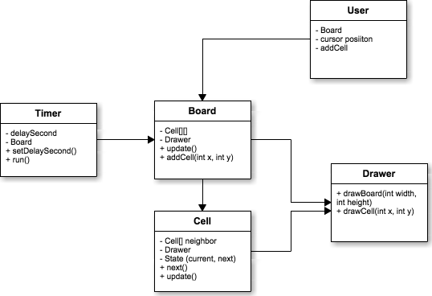

# LifeGame
디자인 패턴 학습을 위한 LifeGame 구현 연습

# CRC table

| Class | Responsibility    | Collaborators |
|-------|-------------------|---------------|
| Cell  | 하나의 셀의 상태를 표현 | Drawer : Cell을 그려달라고 요청함 |
| Board | Cell들을 생성 및 관계 설정 | Cell : 명령(상태 변경 및 업데이트)을 전달   Drawer : Board를 그려달라고 요청함 |
| Timer | 주기적으로 tick을 발생시킴 | Board : tick을 날림 |
| Drawer | 화면에 board의 상태를 그림 | Board, Cell |
| User | 사용자의 입력을 받아 Board에 Cell을 추가함 | Board : cell 추가 요청 |
| Main | 프로그램의 Entry Point | .. 전체 ㅋㅋ |

# Diagram

# Design Pattern

디자인 패턴 학습을 위해 과하게 사용할 예정

